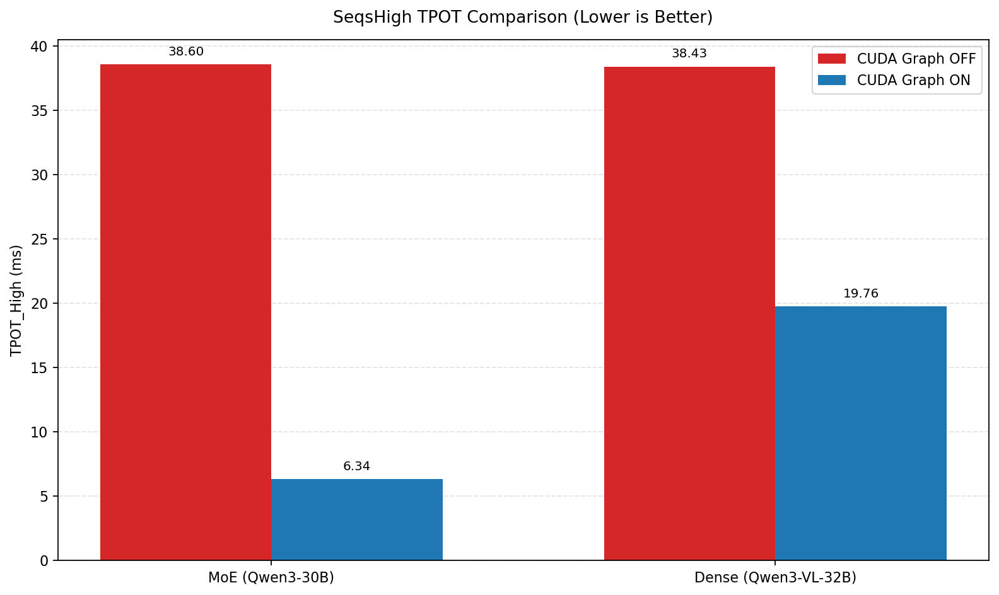
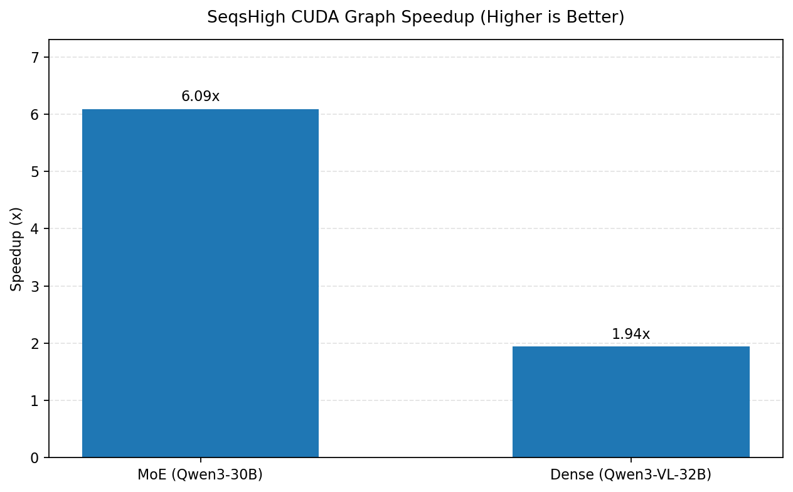
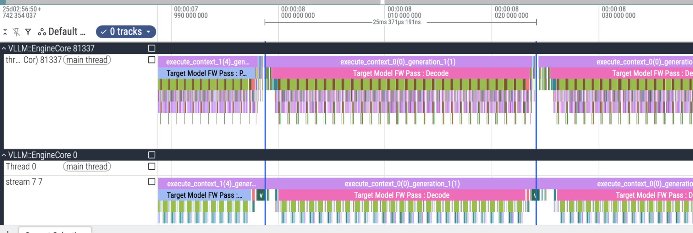
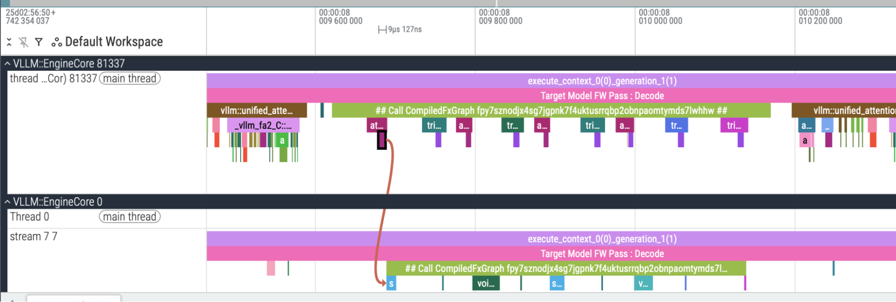
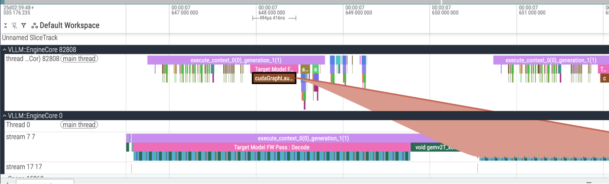
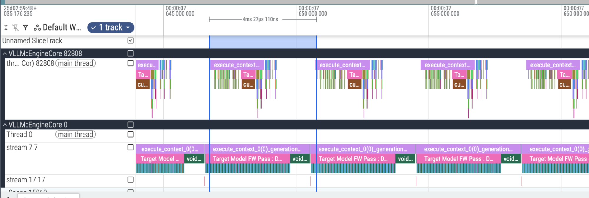
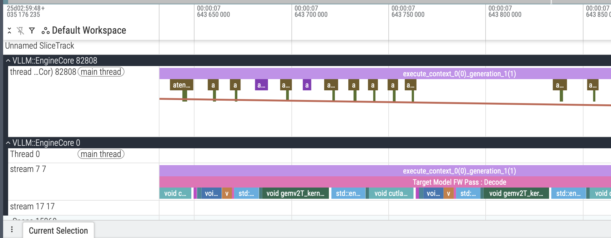

# CUDA Graph Effect Experiment

## Objective

Evaluate how enabling vs disabling CUDA Graph affects decoding latency in vLLM, using `mean_tpot_ms` (time-per-output-token) under different server scheduling limits (`max-num-seqs`) and client concurrency.

## What `main.py` does

The script in `cuda_graph_effect/main.py`:

1. Starts a vLLM server for each config combination.
2. Runs `vllm bench serve` with random prompts.
3. Extracts `mean_tpot_ms` from benchmark JSON output.
4. Compares two `max-num-seqs` values per scenario:
   - Scenario A: `concurrency=4`, `max-num-seqs={4, 32}`
   - Scenario B: `concurrency=32`, `max-num-seqs={32, 128}`
5. Computes:
   - `Speedup = TPOT_Low / TPOT_High` (used in post-table summary)

Lower TPOT is better.

## Benchmark setup from config

- Dataset: random
- Input length: 100 tokens
- Output length: 128 tokens
- Prompts: 50 (`NUM_PROMPTS`)
- Warmups: 5 (`WARMUP_REQUESTS`)
- Request rate: 2.0 req/s
- Server dtype: `bfloat16`
- Server max model len: 256

Experiments were run on an NVIDIA H100 GPU.

## Results

### Model: Qwen/Qwen3-30B-A3B-Instruct-2507

| Spec | CUDAGraph | Concur | SeqsLow | SeqsHigh | TPOT_Low (ms) | TPOT_High (ms) |
| --- | --- | ---: | ---: | ---: | ---: | ---: |
| spec | enabled | 4 | 4 | 32 | 6.56 | 5.74 |
| spec | enabled | 32 | 32 | 128 | 5.31 | 5.51 |
| spec | disabled | 4 | 4 | 32 | 40.61 | 28.15 |
| spec | disabled | 32 | 32 | 128 | 31.47 | 31.14 |
| nospec | enabled | 4 | 4 | 32 | 7.29 | 7.41 |
| nospec | enabled | 32 | 32 | 128 | 7.58 | 6.70 |
| nospec | disabled | 4 | 4 | 32 | 51.53 | 48.46 |
| nospec | disabled | 32 | 32 | 128 | 56.42 | 46.66 |

### Model: Qwen/Qwen3-VL-32B-Instruct-FP8 

| Spec | CUDAGraph | Concur | SeqsLow | SeqsHigh | TPOT_Low (ms) | TPOT_High (ms) |
| --- | --- | ---: | ---: | ---: | ---: | ---: |
| nospec | enabled | 4 | 4 | 32 | 19.71 | 20.20 |
| nospec | enabled | 32 | 32 | 128 | 20.19 | 19.32 |
| nospec | disabled | 4 | 4 | 32 | 34.18 | 33.27 |
| nospec | disabled | 32 | 32 | 128 | 43.78 | 43.59 |

## Speedup summary (image, SeqsHigh only)

This section uses only `TPOT_High` (`SeqsHigh`) values.
For each model, CUDA Graph speedup is computed as:
`speedup = avg(TPOT_High without CUDA Graph) / avg(TPOT_High with CUDA Graph)`.

### TPOT(ms) comparison

### Speedup chart

### Speedup values from SeqsHigh

- MoE model (`Qwen/Qwen3-30B-A3B-Instruct-2507`): `6.09x`
- Dense model (`Qwen/Qwen3-VL-32B-Instruct-FP8`): `1.94x`

## Profiling results (images)

Profiling screenshots are grouped by filename prefix:
- `no_cuda*`: CUDA Graph disabled
- `cuda*`: CUDA Graph enabled

### No CUDA Graph

Caption: CPU-side launch/scheduling overhead is more visible, with larger gaps before GPU work.

Caption: GPU timeline shows many smaller kernel launches instead of compact replay segments.

### CUDA Graph enabled

Caption: CPU involvement is reduced; launch path is shorter and more stable due to graph replay.

Caption: GPU execution appears denser and more regular, indicating lower per-step launch overhead.

Caption: Repeated decode steps are more uniform, consistent with improved TPOT under CUDA Graph.

## Key takeaways

- CUDA Graph enabled reduces TPOT across these experiments, but the gain differs by model architecture and runtime bottleneck.
- For the MoE model (`Qwen/Qwen3-30B-A3B-Instruct-2507`), many small kernels finish quickly on GPU, so decode becomes more sensitive to CPU launch/scheduling overhead; CUDA Graph removes much of that overhead, giving a larger SeqsHigh speedup (`6.09x`).
- For the dense model (`Qwen/Qwen3-VL-32B-Instruct-FP8`), execution is relatively more GPU-bound than CPU-launch-bound, so CUDA Graph still helps but with a smaller SeqsHigh speedup (`1.94x`).
- These speedup values are not universal; they depend on model size/architecture, GPU type, and runtime settings (concurrency, `max-num-seqs`, and workload shape).

## Repro notes

Run:

`python cuda_graph_effect/main.py`

Output CSV is written to:

`log/spec_script/benchmark_results.csv`